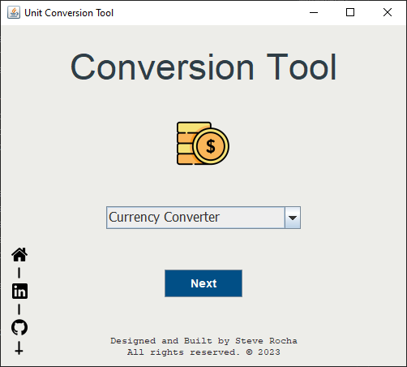
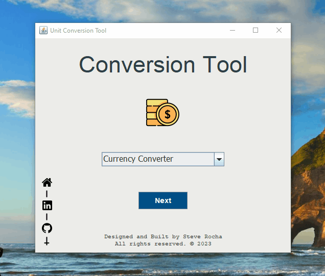
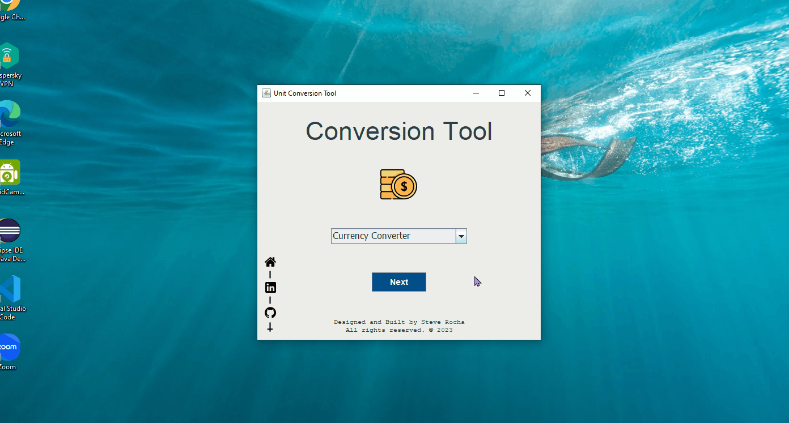

<h1 align="center">:cyclone: CONVERSOR DE UNIDADES :cyclone:</h1>

## :pencil: DESCRIPCION

El presente proyecto es una **Herramienta de Conversión de Unidades** realizado en el lenguaje Java como una aplicación de escritorio. La aplicación Java incluye conversiones para unidades comunes como monedas y temperatura, longitud, peso y volumen (en desarrollo).

El conversor de monedas permite al usuario convertir un valor de una moneda específica a su valor equivalente en otra moneda específica. Mediante su interfaz gráfica, usando la librería Swing, el usuario puede seleccionar las monedas de entrada e ingresar el valor a convertir.

El conversor de temperatura permite al usuario convertir en tiempo real un valor de una temperatura específica a sus valores equivalentes en otras temperaturas conocidas. En este caso se hace uso de las siguientes temperaturas: Celsius, Fahrenheit, Kelvin y Rankine. Mediante su interfaz gráfica, usando la librería Swing, el usuario puede ingresar el valor de la temperatura que desea convertir y visualizar instantáneamente los valores convertidos en el resto de temperaturas.

Los conversores de longitud, peso y volúmen se encuentran actualmente en desarrollo.

Durante el desarrollo de esta aplicación se trabajó bajo una **Metodología Ágil de Desarrollo** utilizando la herramienta **"Trello"**, para organizar y controlar el progreso de mis actividades.

## :bulb: ESTRATEGIA DE DESARROLLO

Para realizar la funcionalidad de conversión de unidades se han aplicado diversos conceptos de la Programación Orientada a Objeto (POO), asi como del uso de Colecciones en Java.

- Aplicación de la Abstracción, Herencia y Polimorfismo en el lenguaje de programación de Java.
- Uso de la colección HashMap.
- Condicionales.
- Expresiones regulares.
- Formatos decimales.
- Manipulación de eventos (eventos de acción y mouse).

### PROXIMA VERSION

- Uso de API para la actualización de tasas de cambio a la fecha actual en que se usa el aplicativo.
- Mayor variedad de monedas para la conversión (agregación de otras tasas de cambio).
- Culminación de las conversiones de unidades de longitud, peso y volúmen.
- Integración de JavaFX.

## :art: DISEÑO

Para el desarrollo de la interfaz gráfica de esta aplicación Java, se dió libertad a la imaginación y criterio propio de mi persona, considerando que sea lo más práctico, sencillo y amigable posible para el usuario. El diseño fue realizado de tal modo que el usuario pueda tener rápido acceso y visualización de la información obtenida como resultado de los datos ingresados en la aplicación.

La interfaz gráfica ha sido realizada usando la librería Swing junto a la herramienta de diseño de interfaz gráfica de usuario de Java, WIndowBuilder, el cual facilita a crear aplicaciones GUI de Java.

## :globe_with_meridians: CARACTERISTICAS DE LA APLICACIÓN JAVA

- Interfaz práctica, sencilla y fácil de usar.
- La aplicación contiene campos para la inserción de datos y para la visualización de los resultados.
- Mecanismo de validación de los datos ingresados por el usuario.
- Todos los conversores de unidades se encuentran integrados en una misma aplicación (contiene una opción desplegable para elegir la conversión que el usuario desea reaizar).
- Conversores de unidades en tiempo real.
- Opción adicional "Reset" para limpiar los campos de datos.
- Compatibilidad con diferentes plataformas.

### CONDICIONES

- Se deben ingresar solo números enteros o decimales.
- No deben ser utilizadas letras ni caracteres especiales, caso contrario, el aplicativo mostrará un mensaje informativo de "error" y no se realizará la conversión.

## :computer: TECNOLOGIAS

Las tecnologías utilizadas para hacer posible el desarrollo de esta aplicación son las siguientes:

- Java 17
- Git
- GitHub

## :dart: ¿COMO USAR?

- Descarga el archivo "UnitConversionTool.jar" de la carpeta "JAR Files" desde este repositorio de GitHub.
- Doble click directamente en el archivo ".jar" para abrir la aplicación ó
- Ejecuta el archivo ".jar" desde la línea de comandos:
    ~~~
            java -jar UnitConversionTool.jar
    ~~~
- Selecciona el conversor de unidades que deseas utilizar desde la lista desplegable, seguido dar click en el botón "Next".
- Ingresa el valor que deseas convertir.
- En el caso del conversor de monedas, dar click en "Convert" para convertir el valor ingresado.
- En el caso del conversor de temperatura, puede limpiar los campos de ingreso de datos con el botón "Reset".
- Para retornar a la ventana principal, puede dar click en el botón "Back".

## :movie_camera: DEMO

## :email: CONTACT ME

